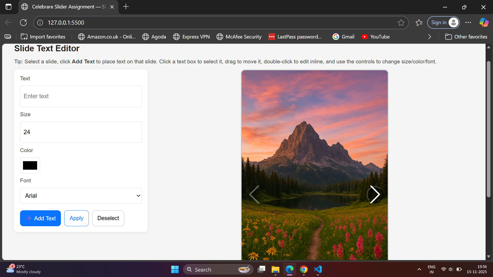
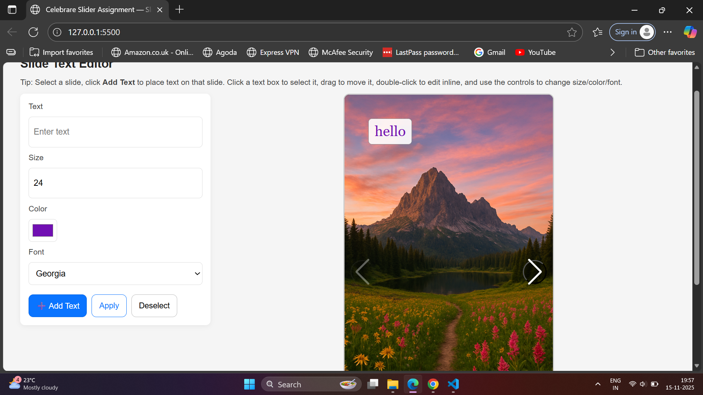

# Slide Text Editor

This project is a customizable image slider with draggable, editable text elements, designed as part of the Celebrare assignment.
It allows users to add, move, edit, and style text directly on top of slider images.

## 🚀 Features
🖼️ Image Slider

Built using Swiper.js

Smooth navigation with Next/Previous arrows

Each slide supports multiple text boxes

## ✏️ Text Editing

Add text to any active slide

Move text boxes freely using drag & drop (desktop + touch supported)

Double-click any text box to edit the text inline (contentEditable)

Resize the text using input controls

Change text color using color picker

Switch between font families

Apply updates instantly to the selected text box

## ✔️ Text Box Tools

Add Text → creates a new draggable box on the active slide

Apply → applies font size, family, color, and text updates

Deselect → remove highlight from selected text

## 🧭 UI Layout

The UI is split into two sections:

Left Panel → Editing Controls

Right Panel → Slider Preview

This makes editing easier and keeps controls accessible.

## 📁 Project Structure
```
/project-root
│
├── index.html
├── styles.css
├── script.js
├── swiper-bundle.min.css
├── swiper-bundle.min.js
│
└── /images
    ├── img1.png
    ├── img2.png
    └── img3.png
```    

## 🛠️ Technologies Used

HTML5 — Base structure

CSS3 — Custom styling + responsive layout

JavaScript (ES6) — Text editing logic, drag-and-drop

Swiper.js — Image slider

## 🧩 How It Works

Select a slide by navigating with arrows/swipe.

Click Add Text to place a text box on that slide.

Click the text box to select it.

Use controls to:

Change text content

Adjust font size

Pick a color

Select font family

Drag the text box anywhere inside the slide.

Double-click to edit the text directly.

## 📱 Responsive Support

Fully mobile-friendly

Dragging and text editing optimized for touch devices

Slider automatically adapts to screen size

## ▶️ How to Run the Project

Download the project folder

Ensure files are structured as shown above

Open index.html in any browser

No backend or installation required

## screenshots





